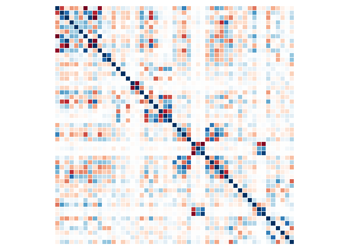
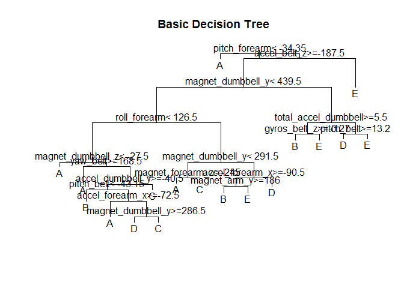
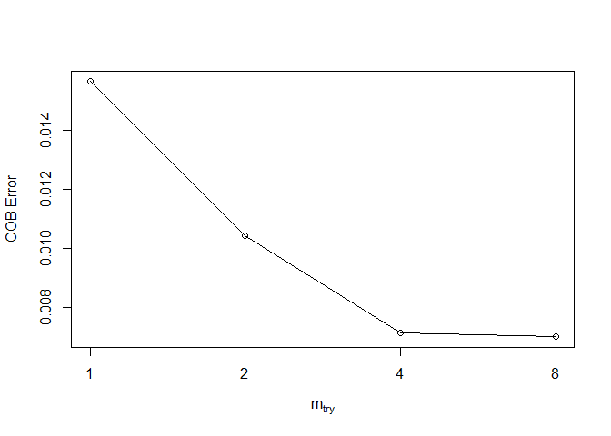
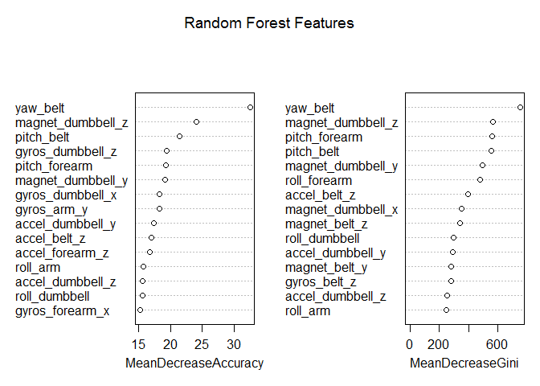

# Practical Machine Learning Assignment
Jenifer Jones  
October 19, 2015  

<h1><b>Introduction</b></h1> 

This project uses a data set of personal activity monitoring values based 
on wearable devices.  The data set represents how well a particular acitivity, 
in this case the Unilateral Dumbbell Biceps Curl was done.  Measurements were 
taken from accelerometers on the belt, forearm, arm and dumbbell.  Each 
user was asked to perform the excercise in five different ways, which map 
to the five different values of the predicted variable.  These are exactly 
according to the specification (A), throwing elbows to the front (B), lifting
the dumbbell only half way (C), lowering the dumbbell only halfway (D) and 
throwing the hips to the front (E).  This data was sourced from <link>http://groupware.les.inf.puc-rio.br/har</link>.  

The purpose of this project was to build a model or models based on the dataset
with the intent to predict the classe variable.  Multiple models were created 
as explained in the content below, each with different levels of accuracy and 
error.  

<h1><b>Data Load </b></h1> 

The first steps taken were to set the working directory for the project, load the R packages required for analysis and load the modeling and evaluation data sets provided. Based on a preliminary look at the data (not included in this markdown file for purposes of brevity) it was found that there are certain types of missing values within the dataset which need to be accounted for during the data load, this was done within the parameters of the "read.csv"" command.  


```r
library(dplyr)
library(ggplot2)
library(caret)
library(randomForest)
library(e1071)
library(lattice)
library(corrplot)
library(rpart)
library(adabag)
library(gbm)

set.seed(13)
setwd(("C:\\Users\\jeniferjones\\SkyDrive\\Coursera\\Data Scientists Toolbox\\COURSE_8_PRACT_ML\\Project"))
modeling<-read.csv("pml-training.csv", na.strings= c("NA", "#DIV/0!"))
evaluation<-read.csv("pml-testing.csv", na.strings= c("NA", "#DIV/0!"))
```

<h1><b>Exploratory Data Analysis </b></h1> 

Taking a look at the structure of the data I found that there are 19,622 observations across 160 variables. Since I noticed a number of "NA" values during the initial data load a summary of the columns was completed to see how prevalent these values were.  


```r
str(modeling)
summary(modeling)
```

It was noted that for many variables the majority of the observations were "NA" so these columns were removed from the dataset for analysis purposes.  For consistency
in modeling these columns were removed from the evaluation set also. This was done by counting all of the "NA" values for all of the variables (with the exception of the predicted variable). Based on this those variables with a count greater than zero were removed from the modeling and subsequently evaluation data. 


```r
Empty_Count <- sapply(1:dim(modeling)[2],function(x)sum(is.na(modeling[,x])))
Removal_List <- which(Empty_Count>0)
modeling<- modeling[, -Removal_List]
evaluation<- evaluation[, -Removal_List]
```

I performed another summary on the data and found that I still had 19,622 observations, but now across only 60 variables.  The first column is just a unique identifier of our record so that will not be relevant to the data analysis and will be removed.  Additionally, the time stamp and user information will also be removed as these are not expected to contribute to the prediction of the activity classification. 


```r
modeling<- modeling[, -c(1:8)]
evaluation<- evaluation[, -c(1:8)]
```

To complete the exploratory analysis a correlation matrix was generated to show where there may be variables that are highly correlated.  The axis descriptions have been removed for readability.  This shows that there is high correlation between the early variables in the data set and some other pockets of high correlation throughout, mostly concentrated in areas that you would expect to be similar based on measurement type. 


```r
modeling_corr<-cor(modeling[, 1:51])
corrplot(modeling_corr, method="color", cl.pos="n", tl.pos="n")
```

 

<h1><b>Model Building</b></h1> 

Now that the training and testing datasets are prepared the predictive modeling can begin.  The variable we are trying to predict is a feature variable which makes this 
a classification problem. 

I decided to use three different predictive modeling methods and will use the model
with the best outcome to submit for the secondary assignment.  The three methods are:

      1. Basic Decision Tree (using the rpart package)
      2. Bagging (using the adabag package) = Used to reduce any over-fitting that
      may have occurred in the original model 
      3. Random Forest (using the randomForest package) = Uses similar boot strapping
      technique as bagging, however random feature sampling is also done at each split
      within the tree.  
      
For all of the models I have created training and testing data sets based on a 70/30
split of the data. The seed has also been set in the first code chunk so that the results are reproducible.


<h3><b>Model 1 - Basic Decision Tree</b> </h3>

The basic decision tree will give us a simple model that can then be visualized 
in a plot in a way that a user will understand how the model makes its predictions.  
This ease of understanding often comes with a trade-off in the models accuracy. 
Below is the model, output of the decision tree and the confusion matrix which highlights the models accuracy.  


```r
set.seed(13)
model_1<-rpart(as.factor(classe)~., data=training, method="class")

par(xpd=TRUE)
plot(model_1, compress=TRUE)
title(main="Basic Decision Tree")
text(model_1)
```

 

```r
model_1.pred<-predict(model_1, testing, type="class")
confusionMatrix(model_1.pred, testing$classe)
```

```
## Confusion Matrix and Statistics
## 
##           Reference
## Prediction    A    B    C    D    E
##          A 1547  316  167  203  129
##          B   31  566   60   24  122
##          C   34  119  752  199  210
##          D   42   97   22  500   53
##          E   20   41   25   38  568
## 
## Overall Statistics
##                                           
##                Accuracy : 0.6683          
##                  95% CI : (0.6561, 0.6803)
##     No Information Rate : 0.2845          
##     P-Value [Acc > NIR] : < 2.2e-16       
##                                           
##                   Kappa : 0.5742          
##  Mcnemar's Test P-Value : < 2.2e-16       
## 
## Statistics by Class:
## 
##                      Class: A Class: B Class: C Class: D Class: E
## Sensitivity            0.9241  0.49693   0.7329  0.51867  0.52495
## Specificity            0.8065  0.95006   0.8843  0.95651  0.97418
## Pos Pred Value         0.6550  0.70486   0.5723  0.70028  0.82081
## Neg Pred Value         0.9640  0.88725   0.9401  0.91027  0.90102
## Prevalence             0.2845  0.19354   0.1743  0.16381  0.18386
## Detection Rate         0.2629  0.09618   0.1278  0.08496  0.09652
## Detection Prevalence   0.4014  0.13645   0.2233  0.12133  0.11759
## Balanced Accuracy      0.8653  0.72350   0.8086  0.73759  0.74957
```

The accuracy of this model based on the confusion matrix is: <b>.6683</b>.  The 
corresponding out of sample error is <b>0.3317</b> or <b>33%</b>.  This is good baseline to start
from as it is a simple model and the expectation is that the more complex models
will perform better. 

<h3><b>Model 2 - Modeling using Bagging </b> </h3>

By using bagging we are adding some complexity into our model by developing 
multiple trees which are then aggregated to make a better set of predictions. 
This method creates multiple predictions for the observations and then uses the 
most often occurrence as the predicted variable.  

Below is the model and the confusion matrix which highlights the models accuracy.  


```r
model_2 <- bagging(classe ~ ., data=training, mfinal=50)
model_2.pred <- predict(model_2, newdata=testing, newmfinal=50)

confusionMatrix(as.factor(model_2.pred$class), testing$classe)
```

```
## Confusion Matrix and Statistics
## 
##           Reference
## Prediction    A    B    C    D    E
##          A 1544  246   58  152  115
##          B   31  632   51   23  118
##          C   38  126  847  143  151
##          D   43   94   39  607   56
##          E   18   41   31   39  642
## 
## Overall Statistics
##                                           
##                Accuracy : 0.7259          
##                  95% CI : (0.7143, 0.7373)
##     No Information Rate : 0.2845          
##     P-Value [Acc > NIR] : < 2.2e-16       
##                                           
##                   Kappa : 0.6502          
##  Mcnemar's Test P-Value : < 2.2e-16       
## 
## Statistics by Class:
## 
##                      Class: A Class: B Class: C Class: D Class: E
## Sensitivity            0.9223   0.5549   0.8255   0.6297   0.5933
## Specificity            0.8644   0.9530   0.9057   0.9529   0.9731
## Pos Pred Value         0.7300   0.7392   0.6490   0.7235   0.8327
## Neg Pred Value         0.9655   0.8992   0.9609   0.9293   0.9140
## Prevalence             0.2845   0.1935   0.1743   0.1638   0.1839
## Detection Rate         0.2624   0.1074   0.1439   0.1031   0.1091
## Detection Prevalence   0.3594   0.1453   0.2218   0.1426   0.1310
## Balanced Accuracy      0.8934   0.7539   0.8656   0.7913   0.7832
```

The accuracy of this model based on the confusion matrix is: <b>0.7259</b> The 
corresponding out of sample error is <b>.2741</b> or <b>27.41%</b>.  This is better
than the general decision tree, but the expectation is that the next two models
will decrease the out of sample error even further. 

<h3><b>Model 3 - Random Forest </b> </h3>

The final model that I developed was a Random Forest Model and was the one 
that I expected to have the highest accuracy.  This is based on the fact 
that while it also creates multiple predictions for each of the observations
it uses a random feature selection approach when developing the tree and uses
the strongest selection at each branch.  

I created two random forest models, one using the caret package with 5-fold 
cross validation specified and the second using the randomForest package selecting 100 
trees and using a tuned mtry value.  

Below are the models and the confusion matrices which highlight their accuracy.  


```r
model_3_caret<-train(classe~., data=training, method="rf", 
               trControl=trainControl(method="cv", number=3), 
               prox=TRUE, allowParallel=TRUE)
model_3_caret.pred<-predict(model_3_caret, testing)
confusionMatrix(model_3_caret.pred, testing$classe)
```

```
## Confusion Matrix and Statistics
## 
##           Reference
## Prediction    A    B    C    D    E
##          A 1674    5    0    0    0
##          B    0 1126    4    0    0
##          C    0    7 1018   10    2
##          D    0    1    4  954    0
##          E    0    0    0    0 1080
## 
## Overall Statistics
##                                           
##                Accuracy : 0.9944          
##                  95% CI : (0.9921, 0.9961)
##     No Information Rate : 0.2845          
##     P-Value [Acc > NIR] : < 2.2e-16       
##                                           
##                   Kappa : 0.9929          
##  Mcnemar's Test P-Value : NA              
## 
## Statistics by Class:
## 
##                      Class: A Class: B Class: C Class: D Class: E
## Sensitivity            1.0000   0.9886   0.9922   0.9896   0.9982
## Specificity            0.9988   0.9992   0.9961   0.9990   1.0000
## Pos Pred Value         0.9970   0.9965   0.9817   0.9948   1.0000
## Neg Pred Value         1.0000   0.9973   0.9983   0.9980   0.9996
## Prevalence             0.2845   0.1935   0.1743   0.1638   0.1839
## Detection Rate         0.2845   0.1913   0.1730   0.1621   0.1835
## Detection Prevalence   0.2853   0.1920   0.1762   0.1630   0.1835
## Balanced Accuracy      0.9994   0.9939   0.9941   0.9943   0.9991
```

The accuracy of this model based on the confusion matrix is: <b>0.9944</b> The 
corresponding out of sample error is <b>.0056</b> or <b>0.56%</b>.

Below is the second random forest model. 


```r
# Use the tuneRF function to determine an ideal value for the mtry parameter
mtry <- tuneRF(training[,1:51], training[,52], mtryStart=1, ntreeTry=100, stepFactor=2, improve=0.05,trace=TRUE, plot=TRUE, doBest=FALSE)
```

```
## mtry = 1  OOB error = 1.57% 
## Searching left ...
## Searching right ...
## mtry = 2 	OOB error = 1.04% 
## 0.3348837 0.05 
## mtry = 4 	OOB error = 0.71% 
## 0.3146853 0.05 
## mtry = 8 	OOB error = 0.7% 
## 0.02040816 0.05
```

 

```r
# The ideal mtry value was found to be 8

model_3_rf <- randomForest(as.factor(classe) ~ ., data=training, importance=TRUE, 
                        ntree=100, mtry=8, allowParallel=TRUE)
model_3_rf.pred <- predict(model_3_rf, testing, type="response")
confusionMatrix(model_3_rf.pred, testing$classe)
```

```
## Confusion Matrix and Statistics
## 
##           Reference
## Prediction    A    B    C    D    E
##          A 1674    3    0    0    0
##          B    0 1129    5    0    0
##          C    0    7 1021    8    0
##          D    0    0    0  956    0
##          E    0    0    0    0 1082
## 
## Overall Statistics
##                                           
##                Accuracy : 0.9961          
##                  95% CI : (0.9941, 0.9975)
##     No Information Rate : 0.2845          
##     P-Value [Acc > NIR] : < 2.2e-16       
##                                           
##                   Kappa : 0.9951          
##  Mcnemar's Test P-Value : NA              
## 
## Statistics by Class:
## 
##                      Class: A Class: B Class: C Class: D Class: E
## Sensitivity            1.0000   0.9912   0.9951   0.9917   1.0000
## Specificity            0.9993   0.9989   0.9969   1.0000   1.0000
## Pos Pred Value         0.9982   0.9956   0.9855   1.0000   1.0000
## Neg Pred Value         1.0000   0.9979   0.9990   0.9984   1.0000
## Prevalence             0.2845   0.1935   0.1743   0.1638   0.1839
## Detection Rate         0.2845   0.1918   0.1735   0.1624   0.1839
## Detection Prevalence   0.2850   0.1927   0.1760   0.1624   0.1839
## Balanced Accuracy      0.9996   0.9951   0.9960   0.9959   1.0000
```

The accuracy of this model based on the confusion matrix is: <b>0.9961</b> The 
corresponding out of sample error is <b>.0039</b> or <b>0.39%</b>.  The following plot
shows the top 15 features that are most important to the analysis. 


```r
varImpPlot(model_3_rf, sort = TRUE, n.var = 15, main = "Random Forest Features")
```

 

<h1><b>Conclusion</b></h1>

Based on the models created the model with the highest accuracy is the Random Forest
model with a tuned mtry parameter and 100 trees.  However, the literature about this
model states that it can cause overfitting so for the next steps in the assignment the 
output from the caret package model will be used. Based on this model I expect the 
out of sample error to be .0056.  

For future modeling I would try principal component analysis based on the information
shown on the correlation matrix which highlights some of the strongly correlated 
features.

<h1><b>Secondary Submission</b></h1>

The second part of this assignment was to apply the model to a set of 20 observations
provided without a classe variable assigned.  The following code was used to create 
a function to copy each of the predictions from the text set into separate files to be submitted. 


```r
Assignment_Predictions <- predict(model_3_caret,evaluation)
Assignment_Predictions
```

```
##  [1] B A B A A E D B A A B C B A E E A B B B
## Levels: A B C D E
```

```r
pml_write_files = function(x){
  n = length(x)
  for(i in 1:n){
    filename = paste0("problem_id_",i,".txt")
    write.table(x[i],file=filename,quote=FALSE,row.names=FALSE,col.names=FALSE)
  }
}

pml_write_files(Assignment_Predictions)
```

Based on this output all of the predicted values were correct when loaded to the 
course submission page.
